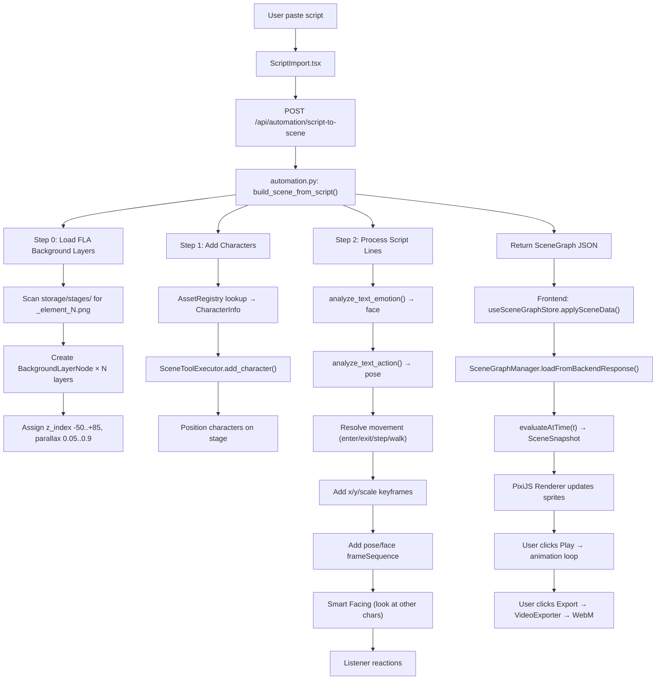

# 01 — Kiến trúc hệ thống AnimeStudio

## Tổng quan kiến trúc

```
┌─────────────────────────────────────────────────────────────────┐
│                         USER / AI Agent                         │
│  "Làm video 30s về 2 bạn trẻ ở quán cà phê"                  │
└──────────────────────────┬──────────────────────────────────────┘
                           │
┌──────────────────────────▼──────────────────────────────────────┐
│  FRONTEND (React + PixiJS v8 + Zustand + TailwindCSS)          │
│                                                                 │
│  ┌──────────────┐  ┌──────────────┐  ┌──────────────────────┐  │
│  │ ScriptImport │  │ AIChatPanel  │  │ AutoVideoPanel (TBD) │  │
│  │ (paste script│  │ (chat + AI)  │  │ (one-click video)    │  │
│  └──────┬───────┘  └──────┬───────┘  └──────────┬───────────┘  │
│         │                 │                      │              │
│  ┌──────▼─────────────────▼──────────────────────▼───────────┐  │
│  │            SceneGraphManager.ts                           │  │
│  │  (Canonical state, evaluateAtTime(t), keyframe interp.)   │  │
│  └──────────────────────┬────────────────────────────────────┘  │
│                         │                                       │
│  ┌──────────────────────▼────────────────────────────────────┐  │
│  │  PixiJS v8 Renderer (SceneRenderer.tsx / PixiStage.tsx)   │  │
│  │  WebGL Canvas 1920×1080 — pose+face compositing           │  │
│  └──────────────────────┬────────────────────────────────────┘  │
│                         │                                       │
│  ┌──────────────────────▼────────────────────────────────────┐  │
│  │  VideoExporter.ts — canvas capture → WebM blob download   │  │
│  └───────────────────────────────────────────────────────────┘  │
└─────────────────────────────────┬───────────────────────────────┘
                                  │ REST API (fetch)
                                  │ /api/automation/script-to-scene
                                  │ /api/scene-graph/ai/direct
                                  │ /api/tts/synthesize
                                  │
┌─────────────────────────────────▼───────────────────────────────┐
│  BACKEND (Python FastAPI — port 8001)                           │
│                                                                 │
│  ┌─────────────────────────────────────────────────────────┐    │
│  │  Routers (API layer)                                    │    │
│  │  ├── automation.py  — Script→Scene pipeline             │    │
│  │  ├── scene_graph.py — Asset list + AI chat              │    │
│  │  ├── tts.py         — Volcengine TTS                    │    │
│  │  ├── stages.py      — Stage management                  │    │
│  │  ├── psd.py         — PSD processing                    │    │
│  │  └── ai.py          — AI workflow endpoints             │    │
│  └──────────────────────────┬──────────────────────────────┘    │
│                             │                                   │
│  ┌──────────────────────────▼──────────────────────────────┐    │
│  │  Core Engine                                            │    │
│  │  ├── scene_graph/                                       │    │
│  │  │   ├── node.py            — SceneNode base            │    │
│  │  │   ├── specialized_nodes  — Character, BG, Camera...  │    │
│  │  │   ├── scene.py           — SceneGraph container      │    │
│  │  │   ├── tools.py           — 16 AI Tool Functions      │    │
│  │  │   └── asset_scanner.py   — PSD registry              │    │
│  │  ├── agents/                                            │    │
│  │  │   ├── director_agent     — AI dàn cảnh (Gemini FC)   │    │
│  │  │   ├── script_analyzer    — AI phân tích pose/face    │    │
│  │  │   ├── stage_analyzer     — AI phân tích bối cảnh     │    │
│  │  │   └── builder_agent      — AI xây scene              │    │
│  │  └── ai_config.py           — Gemini API key rotation   │    │
│  └─────────────────────────────────────────────────────────┘    │
│                                                                 │
│  ┌─────────────────────────────────────────────────────────┐    │
│  │  Storage (backend/storage/)                             │    │
│  │  ├── extracted_psds/  — Characters (pose/face PNGs)     │    │
│  │  ├── stages/          — Background layers (FLA PNGs)    │    │
│  │  ├── assets/          — Shared asset pool               │    │
│  │  ├── tts/             — Generated audio files           │    │
│  │  └── thumbnails/      — Character thumbnails            │    │
│  └─────────────────────────────────────────────────────────┘    │
└─────────────────────────────────────────────────────────────────┘
```

---

## File Map chi tiết

### Backend — Core Engine (⭐ Quan trọng nhất)

| File | Chức năng | Khi nào cần đọc |
|------|-----------|------------------|
| `core/scene_graph/node.py` | `SceneNode` base — transform, keyframes, z_index, get_value_at_time() | Khi sửa animation/rendering |
| `core/scene_graph/specialized_nodes.py` | 6 node types: Character, BackgroundLayer, Camera, Prop, Text, Audio | Khi thêm node type mới |
| `core/scene_graph/scene.py` | `SceneGraph` container — add/remove nodes, describe(), to_dict() | Khi sửa scene structure |
| `core/scene_graph/tools.py` | `SceneToolExecutor` — 16 AI tools (set_position, add_keyframe...) | Khi thêm AI capability |
| `core/scene_graph/asset_scanner.py` | `AssetRegistry` — scan PSD folders → character registry | Khi sửa asset pipeline |
| `core/scene_graph/keyframe.py` | Keyframe interpolation (lerp, ease functions) | Khi sửa animation timing |

### Backend — Routers (API)

| File | Key Endpoints |
|------|---------------|
| `routers/automation.py` | `POST /api/automation/script-to-scene` — **pipeline chính** |
| `routers/scene_graph.py` | `GET /api/scene-graph/characters` — asset list cho frontend |
| `routers/tts.py` | `POST /api/tts/synthesize` — Volcengine text-to-speech |
| `routers/stages.py` | `GET /api/stages/` — list available backgrounds |
| `routers/ai.py` | `POST /api/ai/` — AI workflow endpoints |
| `main.py` | FastAPI app, CORS, static mounts, router registration |

### Backend — AI Agents

| File | Chức năng |
|------|-----------|
| `agents/script_analyzer_agent.py` | Gemini phân tích script → pose/face/movement cho từng dòng |
| `agents/stage_analyzer_agent.py` | Vision AI phân tích layer ảnh → semantic label + z_index |
| `agents/director_agent.py` | AI đạo diễn — dùng Function Calling điều khiển scene |
| `agents/builder_agent.py` | AI builder — emit tool calls xây scene tự động |
| `agents/orchestrator.py` | Coordinator: Director → Builder → Review loop |

### Frontend — Core

| File | Chức năng |
|------|-----------|
| `core/scene-graph/SceneGraphManager.ts` | Canonical scene state, evaluateAtTime(t), loadFromBackend() |
| `core/scene-graph/types.ts` | TypeScript types cho SceneGraph |
| `core/scene-graph/keyframe.ts` | Frontend keyframe interpolation |
| `core/export/VideoExporter.ts` | Canvas → WebM export |
| `core/renderer/Compositor.ts` | PixiJS compositing engine |
| `stores/useSceneGraphStore.ts` | Zustand reactive wrapper |

### Frontend — Components

| File | Chức năng |
|------|-----------|
| `components/studio/editor/StudioMode.tsx` | Main editor layout |
| `components/studio/editor/SceneRenderer.tsx` | PixiJS renderer — pose+face compositing |
| `components/studio/editor/ScriptImport.tsx` | Script/SRT paste UI + character mapping |
| `components/studio/editor/AIChatPanel.tsx` | AI Director chat UI |
| `components/studio/editor/ExportDialog.tsx` | Video export modal |

### External Tools

| File | Chức năng |
|------|-----------|
| `tools/export_fla_to_psd.jsfl` | JSFL script chạy trong Adobe Animate — xuất FLA → layer PNGs |
| `tools/png_to_psd.py` | Convert PNG layers thành PSD file |
| `tools/colab_qwen_server.py` | Alternative AI server (Qwen on Colab) |

---

## Data Flow: Script → Video



---

## Quy ước kỹ thuật quan trọng

### 1. World Coordinates

```
PPU (Pixels Per Unit) = 100
Canvas = 1920×1080 px = 19.2 × 10.8 world units

Center = (9.6, 5.4)
Character standing Y = 7.5 (vertical center-bottom)
Character default scale = 0.25

Khi convert: world_x = pixel_x / PPU
             pixel_x = world_x * PPU
```

### 2. Node Types và Z-Index Convention

```
background_layer:  z = -50..-5   (sky, wall, floor)
character:         z = 0..20     (main characters)
foreground_layer:  z = 25..85    (table, chair, foreground props)
text:              z = 100..110  (subtitles, dialogue bubbles)
camera:            z = N/A       (not rendered, controls viewport)
audio:             z = N/A       (not rendered, controls sound)
```

### 3. Asset Path Convention

```
Characters: /static/extracted_psds/{char_name}/动作/{pose_name}_{hash}.png
            /static/extracted_psds/{char_name}/表情/{face_name}_{hash}.png
Stages:     /static/stages/{stage_name}_element_{N}.png
TTS Audio:  /static/tts/{hash}.wav
Thumbnails: /thumbnails/{char_name}_thumb.png
```

### 4. API Port và Proxy

```
Backend:  http://localhost:8001
Frontend: http://localhost:5173 (Vite dev server)

Vite proxy config (vite.config.ts):
  /api     → http://localhost:8001
  /static  → http://localhost:8001
  /oss     → http://localhost:8001

Frontend api.ts:
  API_BASE_URL = import.meta.env.VITE_API_BASE_URL || ''
  (Empty string = sử dụng Vite proxy, KHÔNG hardcode localhost:8001)
```
