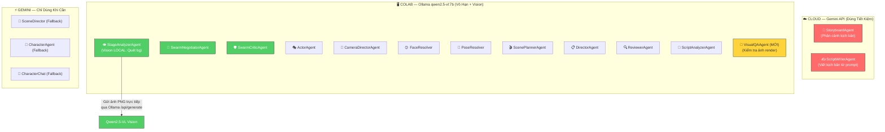

# 🏗️ Kiến Trúc Hệ Thống: Nâng Cấp Lên Qwen2.5-VL

## Kiến Trúc HIỆN TẠI (Qwen2.5 Text-Only)

```mermaid
graph TB
    subgraph "☁️ CLOUD — Gemini API (Có Quota)"
        SB["📜 StoryboardAgent<br/>(Phân cảnh kịch bản)"]
        SW["✍️ ScriptWriterAgent<br/>(Viết kịch bản từ prompt)"]
        SA["👁️ StageAnalyzerAgent<br/>(Vision: Quét background)"]
        SN["🤝 SwarmNegotiatorAgent<br/>(Đàm phán vị trí)"]
        SC["🛡️ SwarmCriticAgent<br/>(Kiểm tra chất lượng)"]
        SP["🎬 ScenePlannerAgent"]
        SD["🎥 SceneDirectorAgent"]
        DA["📋 DirectorAgent"]
        RA["🔍 ReviewerAgent"]
        CA["🧑 CharacterAgent"]
        CC["💬 CharacterChatAgent"]
        SAA["📝 ScriptAnalyzerAgent"]
        BA["🔧 BuilderAgent"]
    end

    subgraph "🖥️ COLAB — Ollama qwen2.5:7b (Vô hạn)"
        AA["🎭 ActorAgent<br/>(Pose/Face planning)"]
        CD["🎥 CameraDirectorAgent<br/>(Góc máy quay)"]
        FR["😊 FaceResolver<br/>(Fallback face)"]
        PR["💪 PoseResolver<br/>(Fallback pose)"]
    end

    subgraph "📸 VISION"
        SA -- "Gửi ảnh PNG<br/>→ Nhận JSON tọa độ" --> GEMV["Gemini Vision API"]
    end

    SA -- "ascii_map + spatial_grid" --> AA
    SA -- "ascii_map + spatial_grid" --> CD
    SA -- "ascii_map + spatial_grid" --> SN
    SN -- "fallback nếu Ollama chết" --> SC

    style GEMV fill:#ff6b6b,stroke:#333,color:#fff
    style SA fill:#ff6b6b,stroke:#333,color:#fff
    style AA fill:#51cf66,stroke:#333,color:#fff
    style CD fill:#51cf66,stroke:#333,color:#fff
```



> **Vấn đề**: Gemini phải gánh **13/17 agent** + toàn bộ Vision. Chỉ có 4 agent chạy trên Ollama. Khi quota hết → pipeline tê liệt.

---

## Kiến Trúc SAU NÂNG CẤP (Qwen2.5-VL:7b)



> **Kết quả**: Gemini chỉ còn gánh **2 agent cốt lõi**. 15/17 agent chạy trên Ollama. Pipeline gần như **tự chủ hoàn toàn**.

---

## Bảng Phân Loại 17 Agent: Ai Chạy Ở Đâu?

| # | Agent | Hiện tại | Sau nâng cấp | Lý do |
|---|-------|----------|-------------|-------|
| 1 | **StoryboardAgent** | ☁️ Gemini | ☁️ Gemini | ⚠️ Không thể thay thế (xem bên dưới) |
| 2 | **ScriptWriterAgent** | ☁️ Gemini | ☁️ Gemini | ⚠️ Không thể thay thế (xem bên dưới) |
| 3 | **StageAnalyzerAgent** | ☁️ Gemini Vision | 🖥️ Ollama VL | ✅ Qwen2.5-VL nhìn ảnh trực tiếp |
| 4 | **SwarmNegotiatorAgent** | ☁️ Gemini | 🖥️ Ollama | ✅ Chỉ cần text reasoning |
| 5 | **SwarmCriticAgent** | ☁️ Gemini (+ Ollama fallback) | 🖥️ Ollama | ✅ Chỉ cần text reasoning |
| 6 | **ActorAgent** | 🖥️ Ollama | 🖥️ Ollama | ✅ Đã chạy local |
| 7 | **CameraDirectorAgent** | 🖥️ Ollama | 🖥️ Ollama | ✅ Đã chạy local |
| 8 | **FaceResolver** | 🖥️ Ollama → ☁️ fallback | 🖥️ Ollama | ✅ Bỏ fallback cloud |
| 9 | **PoseResolver** | 🖥️ Ollama → ☁️ fallback | 🖥️ Ollama | ✅ Bỏ fallback cloud |
| 10 | **ScenePlannerAgent** | ☁️ Gemini | 🖥️ Ollama | ✅ Chỉ cần text reasoning |
| 11 | **DirectorAgent** | ☁️ Gemini | 🖥️ Ollama | ✅ Chỉ cần text reasoning |
| 12 | **ReviewerAgent** | ☁️ Gemini | 🖥️ Ollama VL | ✅ Có thể xem ảnh để review |
| 13 | **ScriptAnalyzerAgent** | ☁️ Gemini | 🖥️ Ollama | ✅ Chỉ cần text reasoning |
| 14 | **SceneDirectorAgent** | ☁️ Gemini | ☁️ Fallback | Có thể migrate nhưng cần test kỹ |
| 15 | **CharacterAgent** | ☁️ Gemini | ☁️ Fallback | Prompt phức tạp, cần model mạnh |
| 16 | **CharacterChatAgent** | ☁️ Gemini | ☁️ Fallback | Cần sáng tạo cao (creative writing) |
| 17 | **BuilderAgent** | ☁️ Gemini | 🖥️ Ollama | ✅ Chỉ cần text reasoning |

---

## 🚫 Những Việc Gemini KHÔNG THỂ Bị Thay Thế

### 1. StoryboardAgent — Phân cảnh kịch bản thô
> [!IMPORTANT]
> Đây là "bộ não tổng đạo diễn" của toàn bộ pipeline. Nó nhận kịch bản thô dài hàng trăm dòng và phải:
> - Hiểu ngữ cảnh dài (long context) để quyết định khi nào cắt scene
> - Mapping chính xác `background_id` từ catalog
> - Gán `emotion` + `action` chính xác cho từng dòng thoại
>
> **Tại sao Qwen2.5-VL 7B không thay thế được?**
> - Context window của Qwen 7B (~8K-32K tokens) quá nhỏ so với kịch bản dài + catalog backgrounds
> - Gemini 2.5 Flash có context **1M tokens**, vượt trội hoàn toàn
> - Đây là task đòi hỏi **sự sáng tạo + hiểu ngữ cảnh dài**, điểm mạnh tuyệt đối của model lớn

### 2. ScriptWriterAgent — Viết kịch bản từ prompt người dùng
> [!IMPORTANT]
> Khi người dùng gõ: *"Tạo một đoạn phim về 2 người cãi nhau trong garage"*, Agent này phải:
> - **Sáng tạo** nhân vật, tính cách, câu thoại từ con số 0
> - Viết dialogue tự nhiên, hài hước, kịch tính
> - Đảm bảo logic câu chuyện mạch lạc
>
> **Tại sao Qwen2.5-VL 7B không thay thế được?**
> - Creative writing quality của model 7B thua xa model 100B+ (Gemini 2.5 Pro)
> - Câu thoại sẽ bị nhàm chán, lặp lại, thiếu sắc thái nếu dùng model nhỏ
> - Đây là task hướng tới **người dùng cuối** — chất lượng phải cao nhất

### 3. CharacterChatAgent — Chat nhập vai nhân vật (nếu có)
> Khi người dùng chat trực tiếp với nhân vật AI, cần model có khả năng **roleplay** tốt, giữ tính cách nhất quán qua cuộc trò chuyện dài. Model 7B thường bị "quên" persona sau vài lượt chat.

---

## 🆕 Khả Năng Mới Được Mở Khóa

### VisualQAAgent (Hoàn toàn mới)
Khi có Qwen2.5-VL, ta có thể tạo một Agent mới: **VisualQAAgent** — AI tự kiểm tra chất lượng hình ảnh đầu ra:
- *"Nhân vật có bị cắt mất đầu không?"*
- *"Background có bị méo không?"*
- *"2 nhân vật có đè lên nhau không?"*

### StageAnalyzer Offline
StageAnalyzerAgent sẽ không cần gọi Gemini Vision nữa. Thay vào đó, nó gửi ảnh PNG trực tiếp qua Ollama API (`/api/generate` với field `images`). Kết quả: **0 API call cho việc quét background**.

### Self-Contained Pipeline
Toàn bộ pipeline `auto_video/generate` (từ lúc bấm nút đến lúc ra Video) chỉ cần **đúng 1 lần gọi Gemini** (cho StoryboardAgent). Phần còn lại 100% local. Nếu quota Gemini hết, pipeline vẫn chạy được nếu người dùng tự viết kịch bản thay vì dùng AI viết.

---

## Tóm Tắt Kiến Trúc Mới

```
┌─────────────────────────────────────────────────────┐
│ NGƯỜI DÙNG nhập kịch bản / prompt                   │
└────────────────┬────────────────────────────────────┘
                 │
        ┌────────▼────────┐
        │  ☁️ GEMINI API  │  ← Chỉ dùng ở đây (1-2 calls)
        │  Storyboard     │
        │  ScriptWriter   │
        └────────┬────────┘
                 │ JSON (scenes, lines, emotions)
        ┌────────▼───────────────────────────────────┐
        │  🖥️ OLLAMA qwen2.5-vl:7b (T4 Colab)      │
        │                                            │
        │  👁️ StageAnalyzer (Vision trực tiếp)      │
        │  🤝 SwarmNegotiator (Vị trí)               │
        │  🛡️ SwarmCritic (Quality Gate)             │
        │  🎭 ActorAgent × N nhân vật (Pose/Face)    │
        │  🎥 CameraDirector (Góc máy)               │
        │  📋 Director, Planner, Reviewer...          │
        │  🔬 VisualQA (Kiểm tra render) [MỚI]      │
        │                                            │
        │  💰 CHI PHÍ: $0 — VÔ HẠN CALLS            │
        └────────┬───────────────────────────────────┘
                 │ Scene Graph + Keyframes
        ┌────────▼────────┐
        │  🎬 VIDEO OUT   │
        └─────────────────┘
```

> [!TIP]
> **Tỷ lệ Gemini vs Ollama sau nâng cấp: 2/17 agent (12%) vs 15/17 agent (88%)**
> So với hiện tại: 13/17 (76%) vs 4/17 (24%)
> → Giảm phụ thuộc Gemini từ 76% xuống còn 12%!
