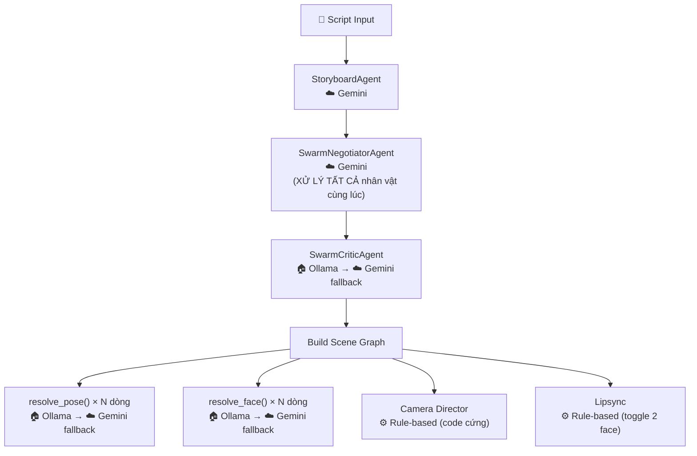
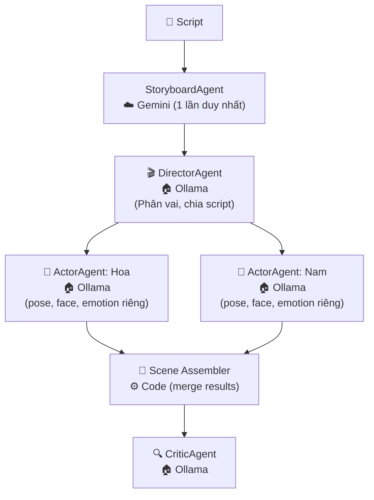
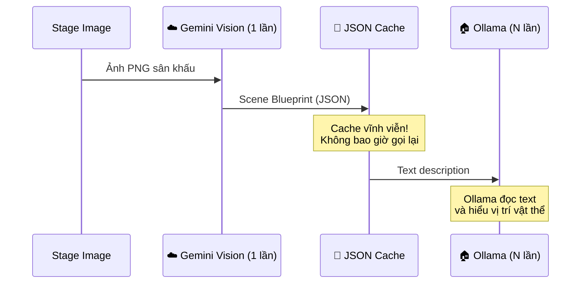
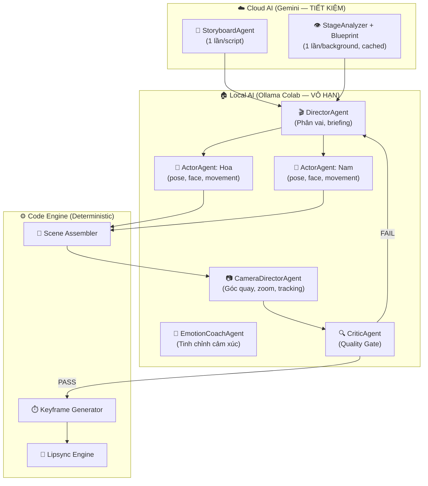

# 🔥 Cuộc Cách Mạng AI — AnimeStudio Agent Architecture

## Tổng quan hiện trạng

### Kiến trúc hiện tại (v1)


### Vấn đề cốt lõi

| # | Vấn đề | Hậu quả |
|---|--------|---------|
| 1 | **Một Negotiator xử lý TẤT CẢ nhân vật** | AI nhầm lẫn pose/face giữa các nhân vật |
| 2 | **Gemini bị 429 liên tục** (3 key đều hết quota) | Pipeline phải chờ 30-60s mỗi lần retry |
| 3 | **Ollama mù hình ảnh** | Không biết sân khấu trông như thế nào → không thể quyết định vị trí/hành động chính xác |
| 4 | **Camera = code cứng** | Góc quay đơn điệu, không có "đạo diễn" AI |
| 5 | **Lipsync = toggle 2 face** | Miệng chỉ đóng/mở, thiếu biểu cảm nói chuyện tự nhiên |
| 6 | **Tất cả agent tranh nhau quota Gemini** | Bottleneck chết người |

### Tài nguyên hiện có

| Tài nguyên | Giới hạn | Điểm mạnh | Điểm yếu |
|---|---|---|---|
| **☁️ Gemini API** (3 keys) | ~60 req/phút/key → bị 429 thường xuyên | Vision, JSON mode chuẩn, nhanh | Quota rất ít, đắt |
| **🏠 Ollama trên Colab** (T4 GPU) | **VÔ HẠN** (chỉ tốn thời gian) | Free, private, tuỳ biến prompt | **MÙ hình ảnh**, chậm hơn Gemini, JSON hay sai format |

---

## 🏛️ CÁCH MẠNG LẦN 1: Per-Character Agent Architecture

### Ý tưởng cốt lõi
> Mỗi nhân vật có **1 Agent Ollama riêng** chịu trách nhiệm toàn bộ diễn xuất của nhân vật đó. Không còn 1 AI xử lý tất cả nhân vật.

### Kiến trúc mới



### Thay đổi cụ thể

#### [NEW] `backend/core/agents/actor_agent.py`
- Mỗi `ActorAgent` instance nhận:
  - Tên nhân vật + ID
  - Danh sách **đầy đủ** poses (28) và faces (97) của nhân vật đó
  - Các dòng thoại **chỉ liên quan** đến nhân vật
  - Stage analysis context (dạng text)
- Agent tự quyết: pose nào, face nào, chuyển động ra sao cho **MỖI DÒNG THOẠI**
- Gọi Ollama riêng → không nhầm lẫn giữa nhân vật

#### [MODIFY] `backend/routers/automation.py`
- Thay thế `resolve_pose()` + `resolve_face()` riêng lẻ bằng cách gọi `ActorAgent.plan_performance(lines)` một lần
- ActorAgent trả về kế hoạch diễn xuất đầy đủ cho tất cả dòng

### Ưu điểm
- ✅ **Triệt để xoá bỏ** nhầm lẫn giữa nhân vật
- ✅ Ollama VÔ HẠN → mỗi nhân vật được AI suy nghĩ kỹ
- ✅ Mỗi Actor biết chính xác 28 poses + 97 faces **của riêng mình**
- ✅ Có thể gọi song song (Ollama hỗ trợ concurrent requests)

### Nhược điểm
- ⚠️ Nhiều nhân vật = nhiều lần gọi Ollama (nhưng VÔ HẠN nên OK)
- ⚠️ Cần logic merge kết quả từ nhiều Actor
- ⚠️ Actor không biết Actor khác đang làm gì (giải quyết bằng DirectorAgent chia briefing)

---

## 👁️ CÁCH MẠNG LẦN 2: Scene Blueprint Protocol (Cho Ollama "Nhìn")

### Vấn đề
Ollama (qwen2.5:7b) hoàn toàn mù hình ảnh. Nó không biết sân khấu trông như thế nào → vị trí đề xuất có thể vô nghĩa.

### Giải pháp: "Scene Blueprint" — Bản Thiết Kế Sân Khấu Dạng Text

> Gemini Vision **xem ảnh 1 lần duy nhất** → sinh ra "Scene Blueprint" dạng text cực kỳ chi tiết → Cache vĩnh viễn → Ollama đọc text này và hiểu được không gian 100%.

#### Quy trình



#### [MODIFY] `backend/core/agents/stage_analyzer_agent.py`
- Bổ sung output mới: `ascii_map` — Bản đồ ASCII của sân khấu
- Ví dụ output Scene Blueprint:

```json
{
  "scene_description": "Showroom xe hơi 4S trong nhà, ánh sáng vàng ấm",
  "ascii_map": [
    "                    [CỬA KÍNH]                    ",
    "  [TV]                              [KỆ BROCHURE] ",
    "         ╔══════════════════╗                      ",
    "         ║   XE Ô TÔ ĐỎ    ║        [MÁY NƯỚC]   ",
    "         ╚══════════════════╝                      ",
    "  [SOFA A]     ~~~SÀN GẠCH~~~     [SOFA B]        ",
    "              [BÀN TRÀ]                            "
  ],
  "spatial_grid": {
    "regions": [
      {"name": "Khu vực sofa trái",  "x_range": [1.0, 5.0], "z_index": 5, "can_stand": true},
      {"name": "Cạnh xe ô tô",       "x_range": [6.0, 13.0], "z_index": 8, "can_stand": true},
      {"name": "Khu vực sofa phải",  "x_range": [14.0, 18.0], "z_index": 5, "can_stand": true},
      {"name": "Gần cửa kính",       "x_range": [3.0, 16.0], "z_index": -5, "can_stand": true}
    ],
    "objects": [
      {"name": "Xe ô tô đỏ", "center_x": 9.6, "z_index": 10, "width": 7.0, "interactive": false},
      {"name": "Sofa A",      "center_x": 3.0, "z_index": 5,  "can_sit": true},
      {"name": "Bàn trà",     "center_x": 9.6, "z_index": 7,  "interactive": true}
    ]
  }
}
```

#### Ollama sẽ nhận prompt dạng:

```
BẠN ĐANG ĐỨNG TRONG: Showroom xe hơi 4S, ánh sáng ấm.

BẢN ĐỒ SÂN KHẤU (ASCII):
                    [CỬA KÍNH]
  [TV]                              [KỆ BROCHURE]
         ╔══════════════════╗
         ║   XE Ô TÔ ĐỎ    ║        [MÁY NƯỚC]
         ╚══════════════════╝
  [SOFA A]     ~~~SÀN GẠCH~~~     [SOFA B]
              [BÀN TRÀ]

KHU VỰC ĐỨNG ĐƯỢC:
- "Khu vực sofa trái": X = 1.0 đến 5.0, Z = 5
- "Cạnh xe ô tô": X = 6.0 đến 13.0, Z = 8
...

Nhân vật của bạn: Hoa (Tuyệt vọng, đang khóc)
Hãy chọn vị trí và tư thế phù hợp.
```

### Ưu điểm
- ✅ Gemini Vision chỉ gọi **1 lần** cho mỗi background (đã cache)
- ✅ Ollama hiểu không gian 3D qua text → quyết định chính xác hơn
- ✅ ASCII map trực quan, dễ debug
- ✅ **Không tốn thêm quota Gemini** (đã cache sẵn từ StageAnalyzer)

### Nhược điểm
- ⚠️ ASCII map chỉ là xấp xỉ, không thay thế được Vision thực sự
- ⚠️ Cần Gemini Vision prompt tốt để sinh ASCII map chính xác
- ⚠️ Một số sân khấu phức tạp khó biểu diễn bằng text

### Giải pháp thay thế: Ollama Vision Model

> [!NOTE]
> Có thể cài model **`minicpm-v`** (3B params) hoặc **`llava:7b`** trên Colab để Ollama có thể nhìn ảnh trực tiếp. Tuy nhiên T4 GPU (16GB VRAM) đã chạy qwen2.5:7b (~5GB), nên chỉ fit thêm model vision nhỏ (~3GB). Đây là option tương lai khi cần vision thực sự trên Colab.

---

## 🎭 CÁCH MẠNG LẦN 3: Specialist Agent Army

### Ý tưởng
> Thay vì code cứng cho Camera, Lipsync, VFX, tạo **agent chuyên biệt** cho từng lĩnh vực, chạy trên Ollama (miễn phí vô hạn).

### Kiến trúc hoàn chỉnh



### Phân chia nhiệm vụ

| Agent | Nền tảng | Số lần gọi | Lý do |
|-------|----------|-------------|-------|
| **StoryboardAgent** | ☁️ Gemini | 1 lần/script | Cần hiểu ngữ cảnh phức tạp, JSON chuẩn |
| **StageAnalyzer** | ☁️ Gemini Vision | 1 lần/background (cached) | Cần nhìn ảnh → sinh Blueprint |
| **DirectorAgent** | 🏠 Ollama | 1 lần/scene | Phân vai, chia briefing cho Actor |
| **ActorAgent × N** | 🏠 Ollama | N nhân vật × 1 lần | Chọn pose/face/movement cho từng dòng |
| **CameraDirectorAgent** | 🏠 Ollama | 1 lần/scene | Quyết định góc quay, zoom cho từng beat |
| **EmotionCoachAgent** | 🏠 Ollama | 1 lần/scene (optional) | Tinh chỉnh cường độ cảm xúc |
| **CriticAgent** | 🏠 Ollama | 1-2 lần/scene | Quality gate |

### Agent mới chi tiết

#### [NEW] `backend/core/agents/actor_agent.py` — Per-Character Actor
```
Input:  Tên nhân vật, danh sách poses/faces, các dòng thoại, Scene Blueprint
Output: [
  { "line_idx": 0, "pose": "抱头", "face": "大哭", "movement": "stand", "intensity": 0.9 },
  { "line_idx": 1, "pose": "走路", "face": "愤怒", "movement": "walk_to:12.0", "intensity": 1.0 }
]
```

#### [NEW] `backend/core/agents/camera_director_agent.py` — AI Camera
```
Input:  Vị trí các nhân vật, beat timing, cảm xúc scene
Output: [
  { "time": 0.0, "type": "wide_shot", "x": 9.6, "zoom": 1.0 },
  { "time": 2.5, "type": "close_up", "target": "Hoa", "zoom": 1.4 },
  { "time": 5.0, "type": "dramatic_zoom", "target": "Nam", "zoom": 1.8, "shake": true }
]
```

#### [NEW] `backend/core/agents/emotion_coach_agent.py` — Emotion Fine-tuner
```
Input:  Actor results + dialogue context
Output: Adjusts: "Hoa line 3: face nên đổi từ '难过' → '大哭' vì đây là đỉnh điểm bi kịch"
```

### Ưu điểm
- ✅ **Chuyên môn hóa triệt để**: mỗi agent làm tốt 1 việc
- ✅ **Camera AI**: góc quay đa dạng, cinematic hơn gấp bội
- ✅ **Emotion Coach**: cảm xúc leo thang tự nhiên như phim thật
- ✅ Gemini chỉ dùng cho 2 việc (Storyboard + Vision) → **gần như hết 429**
- ✅ Tất cả agent "nặng" chạy trên Ollama **VÔ HẠN**

### Nhược điểm
- ⚠️ Pipeline dài hơn (nhiều bước hơn) → tổng thời gian tăng
- ⚠️ Nhiều agent = nhiều prompt cần tinh chỉnh
- ⚠️ Cần orchestrator phức tạp hơn để điều phối
- ⚠️ Debug khó hơn khi có nhiều agent tương tác

---

## 📊 So sánh tổng thể 3 cuộc cách mạng

| Tiêu chí | Hiện tại (v1) | CM1: Per-Character | CM2: + Blueprint | CM3: + Specialist Army |
|-----------|:---:|:---:|:---:|:---:|
| Nhầm lẫn nhân vật | 🔴 Rất nhiều | 🟢 Hết | 🟢 Hết | 🟢 Hết |
| Đa dạng pose/face | 🔴 6/28 pose, 10/97 face | 🟢 28/28, 97/97 | 🟢 28/28, 97/97 | 🟢 28/28, 97/97 |
| Quota Gemini | 🔴 Hết liên tục | 🟡 Giảm 60% | 🟢 Giảm 90% | 🟢 Giảm 95%+ |
| Ollama "nhìn" scene | 🔴 Mù hoàn toàn | 🔴 Mù | 🟢 Hiểu qua Blueprint | 🟢 Hiểu qua Blueprint |
| Camera đa dạng | 🔴 Code cứng | 🔴 Code cứng | 🔴 Code cứng | 🟢 AI Camera Director |
| Cảm xúc tự nhiên | 🟡 Keyword-based | 🟢 AI per-char | 🟢 AI per-char | 🟢 + Emotion Coach |
| Độ phức tạp code | 🟢 Đơn giản | 🟡 Vừa | 🟡 Vừa | 🔴 Cao |
| Thời gian pipeline | 🟢 ~2 phút | 🟡 ~3 phút | 🟡 ~3 phút | 🟡 ~4 phút |
| Tổng điểm | ⭐⭐ | ⭐⭐⭐⭐ | ⭐⭐⭐⭐½ | ⭐⭐⭐⭐⭐ |

---

## 🎯 Đề xuất lộ trình

> [!IMPORTANT]
> Mình đề xuất triển khai **tuần tự từ CM1 → CM2 → CM3**. Mỗi cách mạng xây dựng trên nền của cách mạng trước, và mỗi bước đều tạo ra cải thiện rõ rệt có thể kiểm chứng ngay.

### Phase 1 (Ngay bây giờ): CM1 — Per-Character Actor Agent
- Fix ngay lỗi nhầm nhân vật
- ~2-3 file thay đổi
- Thời gian: 30 phút

### Phase 2 (Tiếp theo): CM2 — Scene Blueprint
- Cho Ollama "nhìn" sân khấu
- Cập nhật StageAnalyzer + prompt cache
- Thời gian: 45 phút

### Phase 3 (Sau cùng): CM3 — Camera Director + Emotion Coach
- Nâng cấp cinematic
- ~3 file mới
- Thời gian: 1-2 giờ

## Open Questions

> [!WARNING]
> 1. **Ollama Vision**: Bạn có muốn thử cài thêm model `minicpm-v` (3B) trên Colab để Ollama có vision thực sự? T4 có 16GB VRAM, đang dùng ~5GB cho qwen2.5:7b, còn dư ~11GB.
> 2. **Mức độ ưu tiên**: Bạn muốn triển khai cả 3 cách mạng cùng lúc, hay từng bước?
> 3. **EmotionCoach**: Có thực sự cần agent riêng hay merge vào ActorAgent?

## Verification Plan

### Automated Tests
- Chạy pipeline tạo video, kiểm tra log:
  - Mỗi ActorAgent chỉ nhận pose/face của **đúng nhân vật mình**
  - Blueprint text xuất hiện trong prompt Ollama
  - Camera keyframes đa dạng (không toàn CLOSE UP)

### Manual Verification
- So sánh video output giữa v1 và sau mỗi cách mạng
- Đếm số unique poses/faces xuất hiện trong 1 scene
