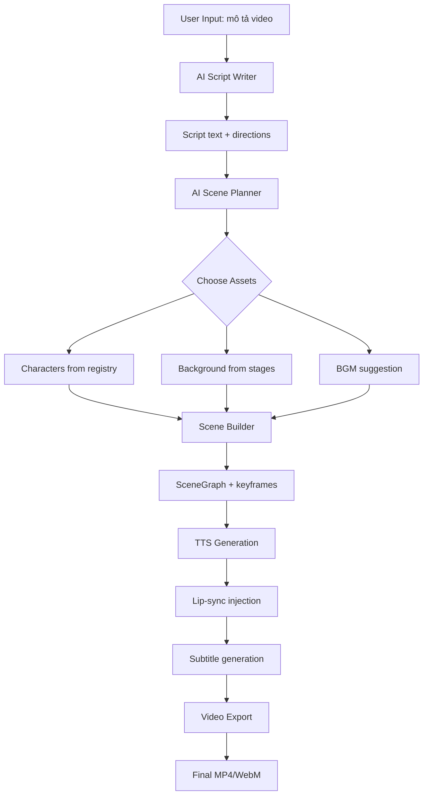

# 09 — Full Automation: AI tự động hoàn toàn

## Mục tiêu cuối cùng

```
User nhập: "Làm video 30 giây về 2 bạn trẻ gặp nhau ở quán cà phê, 
            nói chuyện vui vẻ rồi chia tay"
    ↓
AI tự động:
    1. Viết kịch bản (4-6 câu thoại)
    2. Chọn background (quán cà phê)
    3. Chọn nhân vật phù hợp
    4. Dàn cảnh (pose/face/movement/camera)
    5. Generate TTS audio
    6. Lip-sync
    7. Subtitles
    8. Export video
    ↓
Output: video.mp4 sẵn sàng đăng
```

## Pipeline tự động



## Nhiệm vụ

### Task 9.1: AI Script Writer Agent

**File mới**: `backend/core/agents/script_writer.py`

```python
SCRIPT_WRITER_PROMPT = """
Bạn là biên kịch phim hoạt hình ngắn. Viết kịch bản based on user's description.

Rules:
- Mỗi video 15-60 giây
- 4-10 câu thoại
- Format output:
  [Scene: mô tả bối cảnh]
  [Characters: tên nhân vật 1, tên nhân vật 2]
  [Mood: vui/buồn/kịch tính/hài]
  
  NV1 (hành_động, cảm_xúc): "Câu thoại..."
  NV2 (hành_động, cảm_xúc): "Câu thoại..."
  [NV1 di chuyển sang phải]
  NV1 (hành_động, cảm_xúc): "Câu thoại tiếp..."

Available actions: stand, greet, sit, walk, run, think, point, explain, 
    fight, pray, phone, welcome, cross_arms, open_hands, cover_mouth
Available emotions: happy, sad, angry, scared, surprised, thinking, 
    neutral, excited, shy, confident
"""

async def write_script(user_prompt: str, num_characters: int = 2) -> str:
    """Generate script from user description using Gemini."""
    model = genai.GenerativeModel("gemini-2.0-flash")
    response = await model.generate_content_async([
        SCRIPT_WRITER_PROMPT,
        f"User request: {user_prompt}\nNumber of characters: {num_characters}"
    ])
    return response.text
```

### Task 9.2: AI Scene Planner

**File mới**: `backend/core/agents/scene_planner.py`

```python
SCENE_PLANNER_PROMPT = """
Bạn là đạo diễn hình ảnh. Given a script and available assets, plan the scene.

Available characters:
{character_list}

Available backgrounds:
{stage_list}

Tasks:
1. Assign script characters → available character assets
2. Choose best background for the scene
3. Suggest BGM mood (peaceful/energetic/dramatic/sad)
4. Plan camera movements (static/follow_speaker/zoom_emotion)

Return JSON:
{
    "character_map": {"NV1": "character_id_1", "NV2": "character_id_2"},
    "background": "stage_id",
    "bgm_mood": "peaceful",
    "camera_style": "follow_speaker"
}
"""
```

### Task 9.3: One-Click Video API

**File mới**: `backend/routers/auto_video.py`

```python
@router.post("/api/auto-video/generate")
async def generate_video(request: AutoVideoRequest):
    """
    Full pipeline: user prompt → video file.
    
    Steps:
    1. AI writes script
    2. AI plans scene (characters, background, camera)
    3. Generate TTS audio
    4. Build SceneGraph with all elements
    5. Return scene + audio URLs for frontend to render
    """
    
    # Step 1: Script
    script = await script_writer.write_script(request.prompt)
    parsed = parse_rich_script(script)
    
    # Step 2: Plan
    plan = await scene_planner.plan(parsed, registry, stage_scanner)
    
    # Step 3: TTS
    tts_results = await generate_tts_batch(parsed.dialogues, plan.voice_map)
    
    # Step 4: Build scene
    graph = build_scene_from_script(
        lines=parsed.dialogues,
        character_map=plan.character_map,
        tts_lines=tts_results,
        registry=registry,
    )
    
    # Add background
    stage_scanner.load_stage_into_scene(graph, plan.background)
    
    # Add camera
    add_camera_movements(graph, parsed, plan.camera_style)
    
    # Add subtitles
    add_subtitles(graph, parsed.dialogues, tts_results)
    
    return {
        "scene": graph.to_dict(),
        "audio_urls": [t["audio_url"] for t in tts_results],
        "duration": graph.duration,
    }


class AutoVideoRequest(BaseModel):
    prompt: str                    # "2 bạn trẻ gặp nhau ở quán cà phê"
    duration_target: int = 30      # seconds
    num_characters: int = 2
    language: str = "vi"           # TTS language
    style: str = "casual"          # casual/dramatic/comedy
```

### Task 9.4: One-Click UI

**File mới**: `frontend-react/src/components/studio/editor/AutoVideoPanel.tsx`

```
┌────────────────────────────────┐
│  🎬 Auto Video Generator      │
│                                │
│  Mô tả video:                 │
│  ┌──────────────────────────┐  │
│  │ 2 bạn trẻ gặp nhau ở   │  │
│  │ quán cà phê, nói chuyện │  │
│  │ vui vẻ rồi chia tay     │  │
│  └──────────────────────────┘  │
│                                │
│  Thời lượng: [30s] ▼           │
│  Số nhân vật: [2]  ▼           │
│  Phong cách:  [Casual] ▼      │
│                                │
│  ┌──────────────────────────┐  │
│  │  🚀 Generate Video       │  │
│  └──────────────────────────┘  │
│                                │
│  Progress:                     │
│  ✅ Writing script...          │
│  ✅ Planning scene...          │
│  🔄 Generating audio...       │
│  ⬜ Building scene...          │
│  ⬜ Rendering video...         │
└────────────────────────────────┘
```

### Task 9.5: Multi-scene support

Cho video dài, cần nhiều scene nối tiếp:

```python
@dataclass
class VideoProject:
    scenes: list[SceneGraph]
    transitions: list[str]  # "cut", "fade", "dissolve"
    total_duration: float
    
    def render(self) -> list[dict]:
        """Return all scenes as JSON for sequential rendering."""
        return [
            {
                "scene": s.to_dict(),
                "transition": self.transitions[i] if i < len(self.transitions) else "cut",
            }
            for i, s in enumerate(self.scenes)
        ]
```

Frontend xử lý: render scene 1 → transition → render scene 2 → ... → export single video.

## Thứ tự triển khai đề xuất

| # | Task | Dependencies | Effort |
|---|------|-------------|--------|
| 1 | Task 3.1-3.3 (Fix keyframe/easing) | None | 1 ngày |
| 2 | Task 7.1-7.2 (Subtitle render) | None | 1 ngày |
| 3 | Task 5.1 (Camera render) | None | 1 ngày |
| 4 | Task 6.1 (Audio playback) | None | 1 ngày |
| 5 | Task 5.2 (Camera in automation) | Task 5.1 | 0.5 ngày |
| 6 | Task 6.2 (TTS integration) | Task 6.1 | 1 ngày |
| 7 | Task 8.1 (Audio in export) | Task 6.1 | 1 ngày |
| 8 | Task 5.3-5.4 (Background system) | Task 5.1 | 2 ngày |
| 9 | Task 4.1 (AI script analyzer) | None | 1 ngày |
| 10 | Task 9.1-9.3 (Full automation) | All above | 3 ngày |
| 11 | Task 9.4-9.5 (One-click UI) | Task 9.1-9.3 | 2 ngày |

**Tổng ước tính**: ~14 ngày làm việc cho full automation.
